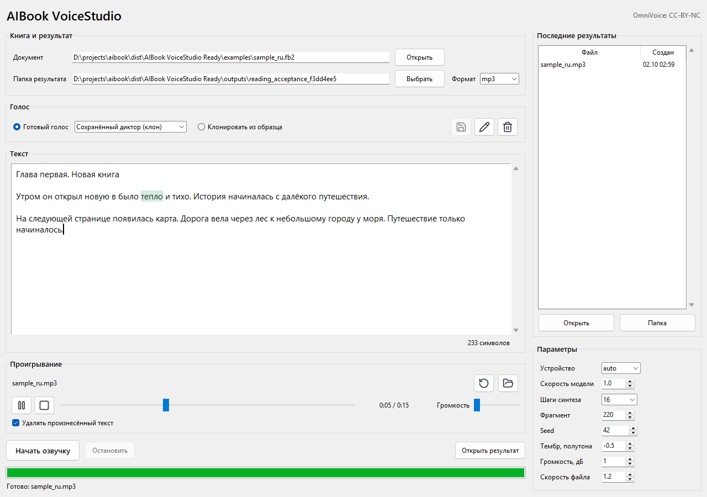

# AIBook VoiceStudio

Отдельное Windows-приложение для локальной озвучки книг через
[VoiceStudio / OmniVoice](https://github.com/debpalash/VoiceStudio).
Синтез, клонирование голосов, проигрывание и синхронизация текста
работают на компьютере. Облачный TTS и API-ключи не нужны.

## Установка Одной Командой

Откройте **PowerShell x64** в Windows 10/11 и выполните:

```powershell
irm https://raw.githubusercontent.com/Fermoders/aibook-voicestudio/main/install-windows.ps1 | iex
```

Команда загружает проверенную сборку релиза `v1.1.0` и создаёт ярлык
«AIBook VoiceStudio» в меню «Пуск». По умолчанию приложение находится в
`%LOCALAPPDATA%\AIBookVoiceStudio` и запускается после установки.

В пакет включены Python 3.11, Tk, PyTorch 2.8 / CUDA 12.8, все Python-пакеты,
FFmpeg/FFprobe, OmniVoice и Whisper tiny. **Python, Git, uv, CUDA Toolkit
и модели отдельно устанавливать не требуется.** При отсутствии подходящего
Microsoft Visual C++ x64 Runtime установщик загрузит подписанный Microsoft
инсталлятор и запросит разрешение Windows. NVIDIA и CUDA-драйвер необязательны:
без совместимого GPU используется CPU.

Нужны интернет для первой установки и рекомендуется **20 ГБ свободного места**.
Размеры загрузки и приложения выводятся перед установкой. Если на системном
диске недостаточно места для загрузок, установщик может использовать кэш
на другом локальном диске. После установки и удаления кэша интернет не нужен.

Установка в выбранную папку без автоматического запуска:

```powershell
& ([scriptblock]::Create((irm https://raw.githubusercontent.com/Fermoders/aibook-voicestudio/main/install-windows.ps1))) -InstallDir 'D:\Apps\AIBookVoiceStudio' -CacheDir 'D:\Downloads\AIBookSetup' -NoLaunch
```

Каждая часть проверяется по SHA-256. Незавершённые загрузки возобновляются.
До публикации установленной папки проверяются все файлы, версии и зависимости
Python-пакетов, нативные библиотеки, Tk, FFmpeg/FFprobe и контрольные суммы
моделей. Повторная команда проверяет уже установленную версию. Ключ
`-ForceReinstall` переустанавливает её с сохранением пользовательских данных
и предыдущей папки программы. Закройте приложение перед переустановкой.

## Возможности

- Книги TXT, FB2, EPUB, DOCX и PDF с текстовым слоем; экспорт WAV/MP3.
- Готовые голоса и постоянные клоны: сохранение, переименование и удаление.
  После сохранения исходный образец и повторный ввод его текста не нужны.
- Редактор с копированием, вставкой, удалением выделения и отменой действий.
- Встроенный плеер, старт с выделенного слова, подсветка и восстановление позиции.
- Режим «Удалять произнесённый текст» с восстановлением оставшегося текста.
  Исходная книга не изменяется; перемотка не удаляет пропущенные слова.
- Скорость, тембр, громкость и продолжение озвучки по сохранённым фрагментам.



Настройки, сохранённые голоса, черновик и кэш: `data\voicestudio` внутри
установленной папки; аудиокниги: `outputs`. Переносите файлы `.aibook.json`
вместе с записью для синхронизации текста. Для звука нужен доступный
аудиовыход Windows. Рекомендуется 16 ГБ RAM; с NVIDIA генерация быстрее.

## Разработка

Подробные настройки и CLI: [README-VoiceStudio.md](README-VoiceStudio.md).
Исходники используют `install_voicestudio.ps1`, локальную `.voice-venv`
и закреплённый checkout VoiceStudio. Это не официальный интерфейс VoiceStudio;
в него не включаются сервер, браузерный UI и необязательные движки upstream.

```powershell
.\install_voicestudio.ps1
.\.voice-venv\Scripts\python.exe .\voice_studio_main.py --doctor
.\.voice-venv\Scripts\python.exe -m unittest discover -s tests -v
.\build_voicestudio_portable.ps1
```

Сборка частей релиза: `scripts\package_windows_release.py`.
Проверка установленного пакета: `scripts\check_windows_installation.py`.
Сценарий нативного интерфейса: `scripts\verify_voicestudio_reading.py`.
Windows CI проверяет исходники и тесты; модели в CI не скачиваются.

Старое приложение XTTS и его локальная portable-сборка не изменены:
[README-XTTS.md](README-XTTS.md).

## Лицензии

Код приложения: [AGPL-3.0](LICENSE). Закреплённая библиотека VoiceStudio:
`v0.5.6`, commit `3915a62cb482bb43117aaebab57d22745bd1cc21`.
Веса OmniVoice: **CC-BY-NC, только некоммерческое использование**;
revision `c5fdb5ccb189668d56333f77ba2629f4cd7535f4`.
Код модели Apache-2.0; аудиокодек имеет условия Boson и Meta Llama 3.
Используйте только голоса, на применение которых у вас есть разрешение.
Исходные лицензии и model card включены в релиз; атрибуция:
[NOTICE-VoiceStudio.txt](NOTICE-VoiceStudio.txt).
